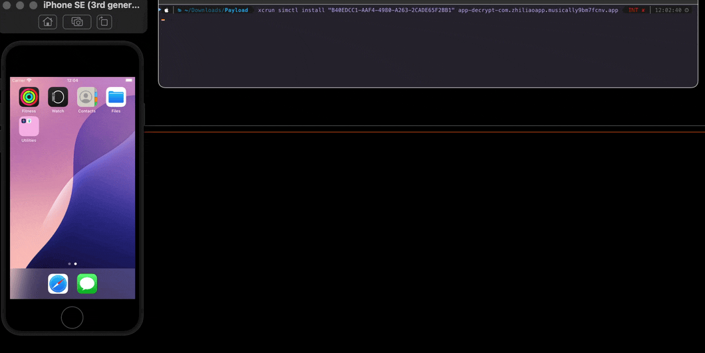

# simforge: Run iOS Apps on Apple Silicon Simulators

simforge is a tool that enables running ARM64 iOS apps on Apple Silicon iOS simulators by modifying the Mach-O binary headers to indicate simulator compatibility.



## Installation

### Using Swift Package Manager

```bash
git clone https://github.com/etharbuckle/simforge.git
cd simforge
swift build -c release
```

This will create two executables:
- `.build/release/simforge`: The core tool
- `.build/release/simforge-cli`: An interactive CLI wrapper

## Usage

### Option 1: Interactive CLI (Recommended)

The CLI tool provides an interactive interface that guides you through the process:

1. Place your .app or .ipa file in the `apps` directory
2. Run the CLI tool:
```bash
.build/release/simforge-cli
```
3. Follow the interactive prompts to:
   - Select the app to process
   - Choose a signing identity
   - Select a simulator

The CLI will automatically:
- Extract IPA files if needed
- Convert the app for simulator use
- Sign all frameworks and the main bundle
- Launch the simulator if needed
- Install and launch the app

### Option 2: Manual Usage

If you prefer manual control, you can use the core tool directly:

1. Extract the `.app` bundle from the IPA:
```bash
unzip /path/to/your-app-decrypted.ipa -d /path/to/destination/
```

2. Convert for simulator:
```bash
simforge /path/to/Payload/YourApp.app
```

3. Code sign the modified app:
```bash
# Sign frameworks first
codesign -f -s "$SIGNING_ID" /path/to/Payload/YourApp.app/Frameworks/*

# Then sign the main app bundle
codesign -f -s "$SIGNING_ID" /path/to/Payload/YourApp.app
```

4. Install to simulator:
```bash
xcrun simctl install "SIMULATOR_UUID" /path/to/Payload/YourApp.app
```

## Configuration

The CLI tool creates a `.simforge_config` file that can store your simulator preference. To change the simulator, simply delete this file and run the CLI tool again.
